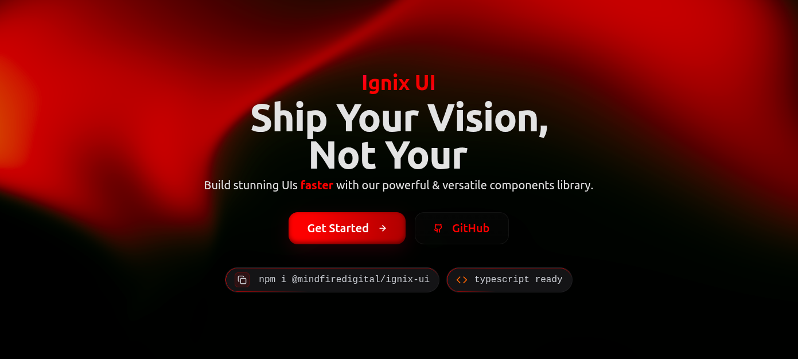

# Ignix UI



Ignix UI is your one-stop solution for modern frontend development. It is a modern, production-ready React UI system that helps ship beautiful, animated, and accessible interfaces fast. Built on top of Tailwind CSS, it streamlines the entire frontend workflow with a cohesive design system, powerful utilities, and developer‑first ergonomics.

Whether prototyping or scaling a large app, Ignix UI gives a polished foundation out of the box—so the focus stays on product, not plumbing.

## Why Ignix UI

- **Built for Speed**  
  Opinionateddefaults,smartAPIs,andaccessible-by-defaultcomponentsthatacceleratedevelopment

- **Design System Ready**  
  Consistentdesigntokens,themes,andpatternsthatscalewithyourteam'sneeds

- **Built-in Animations**  
  Fluidinteractionswithabuilt-inmotionlayer—noextrasetuprequired

- **Type-Safe**  
  BuiltwithTypeScriptforrich,discoverablepropsandbetterIntelliSensesupport

- **Tailwind-Native**  
  SeamlessintegrationwithTailwindCSS,featuringsmartclassmergingthatrespectscustomstyles

## Installation

### Install Package

```bash
# npm
npm install @mindfiredigital/ignix-ui

# yarn
yarn add @mindfiredigital/ignix-ui

# pnpm
pnpm add @mindfiredigital/ignix-ui
```

### Setup

1. Initialize the package:

```bash
npx @mindfiredigital/ignix-ui init
```

2. Add any components you need to your app.

```bash
npx @mindfiredigital/ignix-ui add <component-name>
```

## Documentation

For full documentation, visit [mindfiredigital.github.io/ignix-ui](https://mindfiredigital.github.io/ignix-ui/).

## Contributing

Please follow our [contributing guidelines](https://mindfiredigital.github.io/ignix-ui/docs/contribution-guide/how-to-contribute).

## License

Licensed under the MIT License, Copyright © Mindfire Solutions
